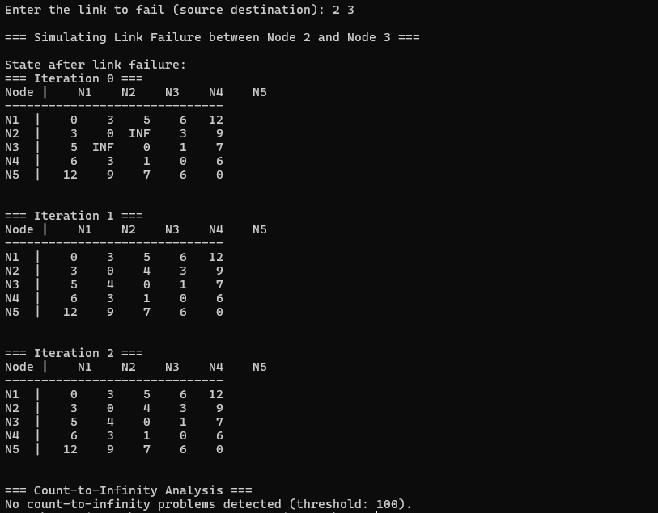

# Distance Vector Routing (DVR) Algorithm

## Overview

This project implements the Distance Vector Routing (DVR) algorithm, designed to find the shortest path between two routers. The DVR algorithm is based on the Bellman-Ford equation, which forms the foundation of this implementation.

## Concept

The DVR algorithm operates through the following steps:

1. **Initialization**: Each node updates its routing table with its initial information.
2. **Sharing Information**: Each node shares its routing table with its neighbors.

3. **Updating Tables**: Upon receiving updates, each node adjusts its routing table according to the information from its neighbors.

4. **Convergence**: This process continues until no more updates occur, indicating convergence.

## Count-to-Infinity Problem

The routing loop problem, commonly referred to as the Count-to-Infinity problem, arises when nodes continually inform each other about their updated paths, leading to infinite increments in path distances. To address this, our implementation includes a condition to limit the maximum number of iterations to 100. If the routing table after nth iteration have distances more than 100, it indicates the presence of a routing loop. The algorithm then reports the nodes exhibiting this property.

## Results

### Case 1: No Count-to-Infinity Detected

- **Figure 1**: This figure displays the results of the implementation under normal conditions without link failure.
  

- **Figure 2**: This figure shows the results after a link failure, where no Count-to-Infinity problem was detected.
  

### Case 2: Count-to-Infinity Detected

- **Figure 1**: This figure displays the input case and the DVR implementation
  

- **Figure 2**: This figure shows the results after a link failure, where Count-to-Infinity problem was detected.
  
  

## How to Run

1. Clone the repository:

   ```bash
   git clone https://github.com/yourusername/dvr-algorithm.git
   cd dvr-algorithm
   ```

2. Compile the code:

   ```bash
   g++ -o dvr implementing_DVR.cpp
   g++ -o count_to_infinity incorporating_link_failure.cpp
   ```

3. Run the program:
   ```bash
   ./dvr
   ./count_to_infinity
   ```
